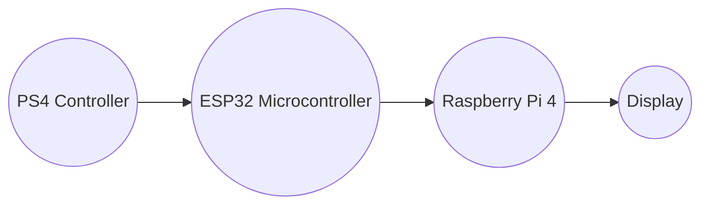
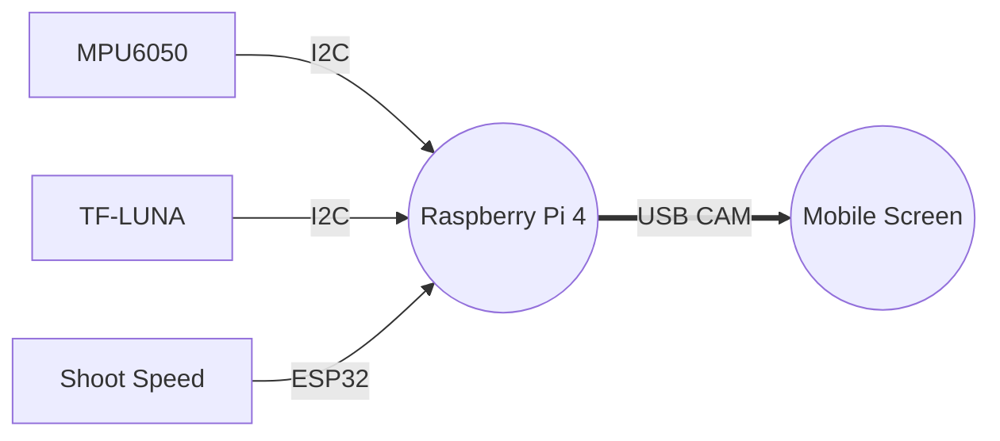

# Elephant-Robot

## Mechanisms
 
 <!--GIF of picking mech  -->
### Picking Mechanism

### Loading and Shooting Mechanism

<!-- GIF of load and shooting mech -->
Check here <!-- [G-Drive link]  -->for the functional demonstration of Elephant Robot.

## Design Plan

### What will be automated?

## Execution

### Stage I
Stage 1 was developed with the objective of enabling manual locomotion control for a 4-wheel holonomic drive system. This functionality was achieved by integrating the turtlesim_teleop key package with a Raspberry Pi 4B. To facilitate the control of motor movements, the project utilized the Twist message type from the Geometric messages library.

In order to interface with the hardware, the Raspberry Pi's GPIO pins were employed to regulate the Pulse Width Modulation (PWM) signals. To effectively assign specific PWM values to the corresponding Raspberry Pi pins, the RPi.GPIO library was leveraged.

This project serves as a foundational framework for controlling locomotion in a precise and customizable manner. By providing a user-friendly interface through the turtlesim_teleop key package, users can manually operate the 4-wheel holonomic drive system with ease. The integration of the Raspberry Pi 4B, along with its GPIO pins and the RPi.GPIO library, offers a reliable and efficient solution for translating software commands into physical motion.
#### Description of scripts

### Stage II
Stage 2 of the project involved integrating the picking and loading mechanisms. The objective was to control these mechanisms using the Raspberry Pi 4's GPIO pins, following the methodology established in Stage 1. Serial communication was established between the Raspberry Pi 4 and the ESP32 microcontroller, enabling the Raspberry Pi 4 to receive PWM data from the PS4 controller via the ESP32. Furthermore, a display was connected to the Raspberry Pi 4 to provide real-time visualization of the PWM signals.

This integration allowed for seamless control and actuation of the picking and loading mechanisms, expanding the capabilities of the Elephant-Robot. By leveraging the communication flow of PS4 → ESP32 → Raspberry Pi 4, the project team successfully incorporated additional mechanisms and ensured efficient control over the robot's functionalities.

UART data transfer between the ESP32 and RPi utilized custom messages. Motors, consisting of String, int, and int data types, conveyed motor control information. MotorArray handled an array input for simultaneous transmission. 

- **Motors Message**:
  - Integer : Represents motor position
  - Integer : Represents motor power
  - String : Provides name

- **MotorArray Message**:
  - Array : Facilitates simultaneous transmission of multiple motor control sets

#### Description of scripts

## Stage III

Stage 3 of the project focused on interfacing sensors with the Raspberry Pi and utilizing ROS (Robot Operating System) to access their values. Specifically, a Time-of-Flight (TOF) distance sensor and an MPU6050 sensor were integrated. The TOF distance sensor provided the distance from the base to the top of the plate, while the MPU6050 sensor measured the angle of the plate relative to the ground.

In the final stage, Stages 2 and 3 were integrated. All the sensor values were published using ROS, and a Command Line Interface (CLI) was developed to subscribe to these values and display them on the screen. This integration allowed for comprehensive monitoring and visualization of the robot's position and orientation, enhancing its overall control and functionality.

#### Description of scripts

- **Sensor Integration**:
  The MPU6050 and Time-of-Flight (TOF) distance sensor communicates with the Raspberry Pi using I2C serial communication.
  MPU6050 provides us with the acceleration and gyroscopic data that is used to calculate the pitch, which directly translates to the angle of the shooting mechanism.
  The TOF Sensor is calibrated by placing it in an open space with no obstruction in LOS(Line-Of-Sight). The output of this sensor is the distance of the object in mm.
  Both the scripts are initialized as publisher nodes, and the data is published continuously using ROS.

- **CLI**:
  The CLI script is responsible for displaying the data to the operator during runtime. It is initialized as a subscriber node and reads the published data from the sensors.
  CLI collects data from three sources:
    - MPU6050 : Angle of the shooting mechanism
    - TF-LUNA : Distance of the base plate from the shooting mechanism
    - Shoot-PWM : PWM value passed to the shooting motors from esp32
  argparser library is used to allow the user to only display data that is wanted. The user can disable certain parameters by initializing them to zero while launching the script. By default, all the parameters are enabled. 

### ROSGRAPH

## Locomotion Automation?