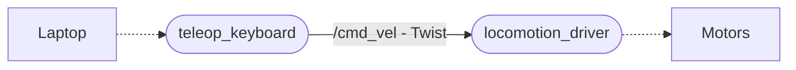

# Elephant-Robot


## Mechanisms
 

### Picking Mechanism


**Components**

| Name | Usage  |
|-----------|-----------|
| IG 32 Planetary DC Geared motor| Actuate base flaps to slide-in the rings on the base plate. |
|IG 42 Planetary DC Geared motor| Rotate the pinion gears.|
| Rack and Pinion assembly| Used for converting rotational motion of <br> motors to linear motion, generating the lift process. |

**Working**
<p align="justify">
The picking mechanism functions through a sequential two-step process. <br>
<b>Step 1</b>: The stack of rings is loaded onto the base plate by employing the sliding motion facilitated by the motor-actuated flaps. Once the rings are securely placed, the first step is finalized.<br> 
<b>Step 2</b>: A lifting mechanism is activated. This mechanism utilizes the concept of rack and pinion, wherein a vertical rectangular frame houses the base plate. The rack rail is connected to two parallel opposite rods, while two motor actuated pinion gears are employed. These pinion gears rotate in opposite directions, creating a combined motion either upward or downward as per the operator's input. The rack seamlessly slides over the pinion gears, resulting in a smooth and rapid movement. As a result, the base plate is elevated, effectively completing the picking mechanism's operation.
</p>


### Loading and Shooting Mechanism


**Components**
| Name | Usage  |
|-----------|-----------|
| IG 32 Planetary DC Geared motor| Actuate 3D printed flaps to load the ring. |
| Magnum 775 Planetary DC Geared motor| Rotate the Polymer acrylic wheels used for shooting.|

**Working**
<p align="justify">
The mechanism following the picking mechanism comprises two primary sub-modules: The loading mechanism and the shooting mechanism. Initially, the ring stack is meticulously aligned within the ring chamber, ensuring precision in subsequent steps. To meet the game's objective of shooting a single ring towards the pole, the picking lift is engaged to lift a single ring with accuracy.  <br>
<b>Loading sub-module</b>: It incorporates two 3D printed flaps controlled by motors, which operate in opposing directions. These flaps effectively push the single ring positioned in front of them, generating a combined outward force.<br> 
<b>Shooting sub-module</b>: It features two Polymer acrylic wheels, actuated by motors rotating in opposite directions. To achieve maximum torque, a rubber coating is added to improve friction between the ring and the wheel. The ring propelled by flaps in the previous step, passes through these wheels. The rotary motion of the wheels, transformed into a linear projectile trajectory, imparts a net torque to the ring, propelling it with force in the forward direction and with precision towards the designated target.
</p>

 [Functional demonstration of Elephant Robot.](https://drive.google.com/drive/folders/12eOtcUv3KmfZOIFXidKJ_DFHE5_mUBqX?usp=drive_link)

## Design Plan

### What will be automated?
<p align="justify">
Primary focus lies on to automate lifting and loading process.<br>
To shot the perfectly the top most ring within the ring must be perfectly aligned with the flaps. For this to achieve the motor responsible for linear motion of the ring stack should rotate just enough so that the stack rise thickness equal to the width of ring.<br>
This proposes that the motor should be operated in position controlled close loop system. To figure out how much the motor has rotated, the sensor which was proposed was to use a magnetic encoder mounted on the shaft of motor.<br>
Instead of using encoder to receive the feedback a distance sensor was utilized to measure the distance of the base plate onto which the stack rests. This not only eliminates the fact that encoders cannot take into account the slippage of gear but provide a direct feedback of the ring position.<br>
Once the ring aligns perfectly, which can be achieved using a control loop algorithm such as PID, the loading motor can be actuated to shoot the ring by feeding into the roller mechanism.

## System Design

With proposed ideology decisions  were made to use Raspberry Pi to perform the automation task and ESP32 to perform the manual operations such as handing locomotive and shooting system.


### Motor Division


Motors were categorized  based on the operation they perform.<br>
**Locomotion**
- M1, M2, M3, M4 are the motors working in unison to locomote the robot. Since a X-omni drive was utilized 4 motor were needed.
- BaseFlaps motors are responsible to slide-in the rings on the base plate which lifts the ring stack to shooting mechanism.

**Shoot**
- Linear actuator helped to get the right angle of launch for the rings.
- Motors attached to rollers spun at the right speed to launch the ring.

**Pick**
- Motors connected to rack were used to lift the stack of rings.
- Motors connected to flaps were used to load the ring into the shooting rollers.

 

### Ideation

ESP32 was assigned to control the locomotion and shooting system while receiving the control signals from the operator using PS4 controller via bluetooth media.
The control signal was then passed to Raspberry Pi through serial communication which controlled the Pick-Load system.<br>
**ROS** was deployed on Raspberry Pi to handle the simultaneous task on receiving data from the sensor and control signal form ESP32, controlling the motors.

## Execution

### Stage I
Stage 1 was developed with the objective of enabling manual locomotion control for a 4-wheel holonomic drive system. This functionality was achieved by integrating the turtlesim_teleop key package with a Raspberry Pi 4B. To facilitate the control of motor movements, the project utilized the Twist message type from the Geometric messages library.

In order to interface with the hardware, the Raspberry Pi's GPIO pins were employed to regulate the Pulse Width Modulation (PWM) signals. To effectively assign specific PWM values to the corresponding Raspberry Pi pins, the RPi.GPIO library was leveraged.

This project serves as a foundational framework for controlling locomotion in a precise and customizable manner. By providing a user-friendly interface through the turtlesim_teleop key package, users can manually operate the 4-wheel holonomic drive system with ease. The integration of the Raspberry Pi 4B, along with its GPIO pins and the RPi.GPIO library, offers a reliable and efficient solution for translating software commands into physical motion.




#### Description of scripts

- **Locomotion**:

    - The script enables locomotion control for a robot using four-wheel drive.
    - A laptop remotely connects to the Raspberry Pi (Raspi) using SSH and the Raspi's IP address via terminal access. Once connected, the laptop launches the ROS master server and starts the locomotion_driver node and the teleop_keyboard node.
    - The teleop_keyboard node receives commands from the laptop's keyboard input.The teleop_keyboard node publishes speed and direction commands as a Twist message to the cmd_vel topic.
    - The locomotion_driver node subscribes to the cmd_vel topic to receive and interpret the robot's commands.
    - Kinematic equations are employed by the locomotion node to determine the required actions for the robot's movement.
    - The Raspi's RPi library connects the PWM pins to the Cytron MD 10 motor driver, which controls the motors responsible for the robot's locomotion.

    - This script serves as a pilot stage for integrating the Robot Operating System (ROS), Raspberry Pi, and the robot's hardware components. 

### Stage II
Stage 2 of the project involved integrating the picking and loading mechanisms. The objective was to control these mechanisms using the Raspberry Pi 4's GPIO pins, following the methodology established in Stage 1. Serial communication was established between the Raspberry Pi 4 and the ESP32 microcontroller, enabling the Raspberry Pi 4 to receive PWM data from the PS4 controller via the ESP32. Furthermore, a display was connected to the Raspberry Pi 4 to provide real-time visualization of the PWM signals.

This integration allowed for seamless control and actuation of the picking and loading mechanisms, expanding the capabilities of the Elephant-Robot. By leveraging the communication flow of PS4 → ESP32 → Raspberry Pi 4, the project team successfully incorporated additional mechanisms and ensured efficient control over the robot's functionalities.

UART data transfer between the ESP32 and RPi utilized custom messages. Motors, consisting of String, int, and int data types, conveyed motor control information. MotorArray handled an array input for simultaneous transmission. 

- **Motors Message**:
  - Integer : Represents motor position
  - Integer : Represents motor power
  - String : Provides name

- **MotorArray Message**:
  - Array : Facilitates simultaneous transmission of multiple motor control sets


#### Description of scripts
- UART Node:
    - Task 1:
        - Responsible for establishing a serial connection between the ESP32 and Raspi.
        - Handles serial data communication between the two devices.
        - Uses the Pyserial library to collect and format data sent serially from ESP32.
        - Adheres to the required baud rate for ESP32 and the port to which the ESP32 is connected to the Raspi.
        - The serially transmitted data comprises commands sent by the ESP32, which is connected to a wireless controller operated by the robot operator.
        - To reduce bit errors, a frame format is maintained that includes start bit, ack bit, and flag bits for reliable communication.

    - Task 2:
        - The UART node, after collecting and formatting the serially received data, publishes it to the cmd_motors topic using a custom message data structure (motor, motorArray).
        - The data published includes actuation commands for the motor driver. The custom message data structure ensures that the actuation data is properly formatted and communicated to the other drivers.
        
<br>

- Pick Driver Node:
   - Acts as the second driver responsible for actuating the picking mechanism.
   - Subscribes to the cmd_motors topic, where the UART node publishes the data.
   - Interprets the received data and passes it through a mathematical model to generate the required actuation data signals for the motor driver.
   - The commands sent by the operator through the wireless controller serve as the basis for generating the actuation signals.
   - Uses a custom-made message data structure to publish the actuation data to the cmd_motors topic.

- Load Driver Node:
   - Similar to the pick driver node, it handles actuation for the load mechanism motors.
   - Acts as the third driver in the system.
   - Subscribes to the cmd_motors topic to receive actuation data published by the UART node.
   - Interprets the received data and generates the required actuation signals for the motor driver.
   - The purpose is to control the actuation of the load mechanism based on the commands sent by the operator.

The objective of this stage is to establish UART communication and wirelessly control the actuations of both the picking and load mechanisms. The UART node facilitates serial communication between the ESP32 and the Raspi, while the pick driver and load driver nodes interpret the received data and generate the necessary actuation signals for their respective mechanisms.

## Stage III

Stage 3 of the project focused on interfacing sensors with the Raspberry Pi and utilizing ROS (Robot Operating System) to access their values. Specifically, a Time-of-Flight (TOF) distance sensor and an MPU6050 sensor were integrated. The TOF distance sensor provided the distance from the base to the top of the plate, while the MPU6050 sensor measured the angle of the plate relative to the ground.

In the final stage, Stages 2 and 3 were integrated. All the sensor values were published using ROS, and a Command Line Interface (CLI) was developed to subscribe to these values and display them on the screen. This integration allowed for comprehensive monitoring and visualization of the robot's position and orientation, enhancing its overall control and functionality.

#### Description of scripts

  

- **Sensor Integration**:

	- The MPU6050 and Time-of-Flight (TOF) distance sensor communicates with the 		 Raspberry Pi using I2C serial communication.

	- MPU6050 provides us with the acceleration and gyroscopic data that is used to calculate the pitch, which directly translates to the angle of the shooting mechanism.

	- The TOF Sensor is calibrated by placing it in an open space with no obstruction in LOS(Line-Of-Sight). The output of this sensor is the distance of the object in mm.

	- Both the scripts are initialized as publisher nodes, and the data is published continuously using ROS.

  

- **CLI**:

	- The CLI script is responsible for displaying the data to the operator during runtime. It is initialized as a subscriber node and reads the published data from the sensors.

	- CLI collects data from three sources:

		- MPU6050 : Angle of the shooting mechanism

		- TF-LUNA : Distance of the base plate from the shooting mechanism

		- Shoot-PWM : PWM value passed to the shooting motors from esp32

	- argparser library is used to allow the user to only display data that is wanted. The user can disable certain parameters by initializing them to zero while launching the script. By default, all the parameters are enabled.

  


### ROSGRAPH


## Locomotion Automation?


**Site-Map**
```
├── images
│   ├── ER.png
│   ├── Picking_Mechanism.gif
│   ├── rosgraph.jpeg
│   └── Shooting_Mechanism.gif
│
├── launch
│   └── elephant_robot.launch
│
├── msg
│   ├── motorArray.msg
│   └── motor.msg
│
├── src
│    ├── CLI
│    │   ├── CLI.py
│    │   ├── CLI_test.py
│    │   └── requirements.txt
│    ├── ESP32
│    │   └── ESP32.ino
│    ├── STAGE_1
│    │   └── locomotion_driver.py
│    ├── STAGE_2
│    │   ├── load_driver.py
│    │   ├── pick_driver.py
│    │   └── uart.py
│    └── STAGE_3
│        ├── mpu_interface.py
│        ├── test
│        │   ├── df_tof.py
│        │   ├── encoder
│        │   │   ├── encoder.py
│        │   │   └── enco_lib.py
│        │   ├── limit_switch.py
│        │   ├── mpu_lib.py
│        │   ├── pick_test.py
│        │   ├── sensor_driver.py
│        │   └── tof_with_filter.py
│        └── tof_interface.py
│
├── launch.sh
│
├── CMakeLists.txt
├── package.xml
│
└── README.md
```